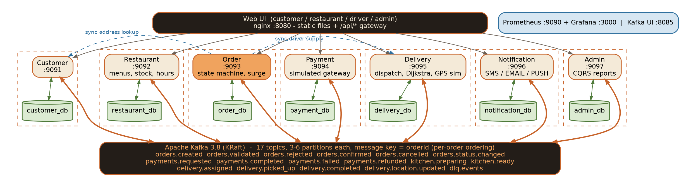
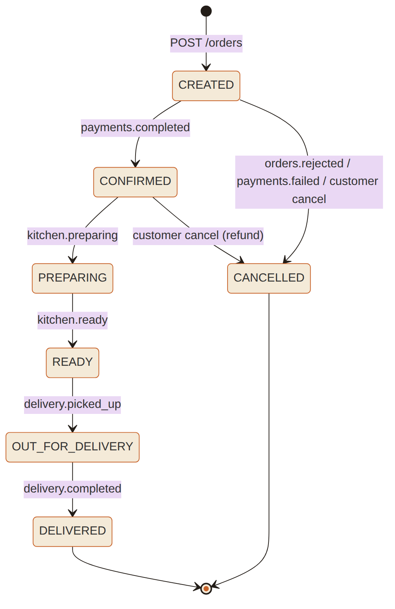
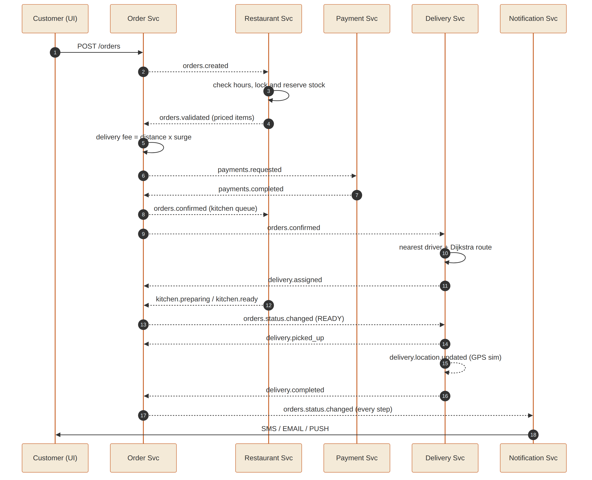

# NamEats / NamDeliver — Distributed Food Delivery Platform

**DSA612S – Distributed Systems and Applications · Assignment 2 · Question 1**

An event-driven food delivery platform for Namibian SMEs (restaurants and delivery drivers),
built as seven **Ballerina** microservices that coordinate through **Apache Kafka**, persist to
**MySQL** (database-per-service), and run as a single **Docker Compose** stack with a web UI,
Kafka UI, Prometheus and Grafana.

| Group member | Student number |

Dawid Cornelius /Howoseb  200911422 
Dredleen So-Oabes  223052558 
Saara Salomo 224041320
Ellen De Wet 222033266
Magdalena Johannes 222134836
Eliyno D C Gaeb 218123116


---

## 1. Quick start (one command)

**Prerequisites:** Docker Desktop (or Docker Engine + Compose v2) with ~6 GB RAM allocated, and
an internet connection for the first build (Docker images + Ballerina Central packages).

```bash
docker compose up --build -d
docker compose ps            # wait until the 7 services show "healthy" (2-4 min on first build)
```

| What | URL |
|---|---|
| **Web UI** (customer / restaurant / driver / admin) | http://localhost:8080 |
| Kafka UI (topics, partitions, consumer groups, messages) | http://localhost:8085 |
| Grafana (admin / admin) → dashboard *NamDeliver – Microservices Overview* | http://localhost:3000 |
| Prometheus | http://localhost:9090 |
| Services directly | http://localhost:9091 … 9097 |
| MySQL (root / rootpass) | localhost:3307 |
| Kafka for local `bal run` | localhost:29092 |

Run the scripted end-to-end demo (needs `bash`, `curl`, `jq` – use Git Bash or WSL on Windows):

```bash
./scripts/demo.sh
```

It walks one order through the whole life-cycle, then shows a **payment failure** (order above
N$1500 → CANCELLED + stock restored) and a **restaurant rejection** (out-of-stock item).

Stop / reset:

```bash
docker compose down          # stop
docker compose down -v       # stop AND wipe Kafka + MySQL data (re-seeds on next start)
```

---

## 2. Live demo with the UI (defence script)

1. **Customer tab** – choose *Ndapewa Shikongo*, address *Home (Katutura)*, restaurant
   *Kapana Corner Grill*, add items, **Place order**. Watch the order go
   `CREATED → CONFIRMED` within ~2 s (restaurant validated + reserved stock, payment simulated).
   The bill shows the distance-based delivery fee × surge multiplier. A driver is dispatched
   and the map shows the Dijkstra route; the driver dot starts moving to the restaurant.
2. **Restaurant tab** – select *Kapana Corner Grill*; the paid order is in the kitchen queue.
   Click **Start preparing**, then **Mark ready**. Stock in the inventory table has dropped.
3. **Driver tab** – select the assigned driver (shown in the customer tracking panel),
   click **Picked up** → order is `OUT_FOR_DELIVERY` and the driver drives to the customer on
   the map. Click **Delivered**.
4. **Admin tab** – KPIs, restaurant statistics, driver performance, platform health, fleet and
   the live notification stream (SMS / EMAIL / PUSH to customers, restaurants and drivers).
5. **Kafka UI** – show the 17 topics, their partitions, message keys (= orderId) and the
   seven consumer groups with zero lag.
6. **Fault tolerance** – `docker compose stop delivery-service`, place an order (it still
   confirms; deliveries wait in Kafka), `docker compose start delivery-service` → it consumes
   the backlog and dispatches a driver. Same with any service.
7. **Surge pricing** – set all drivers offline except one (driver tab) and place a few orders:
   the header badge rises above ×1.00 and new orders get a higher delivery fee.

---

## 3. Architecture



| Service | Port | Owns (database) | Responsibilities |
|---|---|---|---|
| customer-service | 9091 | `customer_db` | Accounts, delivery addresses, order history (read model from events) |
| restaurant-service | 9092 | `restaurant_db` | Menus, real-time inventory, opening hours, kitchen queue; validates & reserves stock |
| order-service | 9093 | `order_db` | **Central order state machine**, pricing + **surge pricing**, status history |
| payment-service | 9094 | `payment_db` | Simulated payment gateway, refunds (saga compensation) |
| delivery-service | 9095 | `delivery_db` | Driver fleet, nearest-driver dispatch, **route optimisation**, **GPS simulation**, tracking |
| notification-service | 9096 | `notification_db` | Multi-channel alerts (SMS / EMAIL / PUSH) to customers, restaurants, drivers, admin |
| admin-service | 9097 | `admin_db` | Restaurant statistics & delivery performance reports (CQRS), platform health |

### Order life-cycle (state machine)



### Event choreography



Full design notes – topics, partitioning, consumer groups, schema, reliability patterns, API
reference – are in **[docs/DESIGN.md](docs/DESIGN.md)**.

---

## 4. How the marking criteria are addressed

| Criterion | Where to look |
|---|---|
| **Kafka setup & topic management (15%)** | `infra/kafka/create-topics.sh` (explicit topics, 3–6 partitions, retention, auto-create disabled); `shared/common.bal` (idempotent producer `acks=all`, manual-commit consumers, retries, **dead-letter topic**); orderId message keys for per-order ordering; one consumer group per service |
| **Database setup & schema design (10%)** | `infra/mysql/01-schema.sql` – database-per-service, least-privilege DB user per service, constraints/indexes/FKs, audit table, read models, idempotency tables |
| **Microservices in Ballerina (50%)** | `services/*/service.bal` – 7 services, REST APIs with validation & proper status codes, state machine with optimistic locking, saga compensation (restock / refund / driver release), out-of-order event handling with tombstones |
| **Docker configuration & orchestration (20%)** | `docker-compose.yml` + multi-stage `Dockerfile` per service, health checks, `depends_on` conditions, restart policies, isolated network, JVM memory limits, volumes |
| **Documentation & presentation** | This README, `docs/DESIGN.md`, diagrams in `docs/diagrams/`, `scripts/demo.sh` |
| **Bonus** | Driver location simulation on a live map · Dijkstra route optimisation over a Windhoek road graph · surge pricing · complete web UI · Prometheus + Grafana observability |

---

## 5. Project layout

```
.
├── docker-compose.yml           # whole platform
├── services/
│   ├── customer-service/        # Ballerina.toml, service.bal, Dockerfile, Config.docker.toml
│   ├── restaurant-service/
│   ├── order-service/
│   ├── payment-service/
│   ├── delivery-service/        # + routing.bal (Dijkstra)
│   ├── notification-service/
│   └── admin-service/
├── shared/                      # events.bal (event contract) + common.bal (Kafka/DB helpers)
├── infra/
│   ├── kafka/create-topics.sh
│   ├── mysql/01-schema.sql
│   ├── nginx/nginx.conf         # API gateway for the UI
│   ├── prometheus/prometheus.yml
│   └── grafana/provisioning/    # datasource + dashboard
├── ui/                          # index.html, app.js, styles.css (Leaflet map)
├── scripts/demo.sh              # scripted end-to-end run
├── scripts/sync-shared.sh       # copy shared/*.bal into every service
└── docs/                        # DESIGN.md + diagrams
```

`shared/events.bal` and `shared/common.bal` are **copied** into every service (already done)
so each service builds and deploys on its own. After editing them, run
`./scripts/sync-shared.sh`.

---

## 6. Running a service outside Docker (development)

```bash
docker compose up -d mysql kafka kafka-init        # infrastructure only
cd services/order-service
bal run                                            # uses localhost:29092 and localhost:3307 defaults
```

Requires Ballerina Swan Lake **2201.10.3** (`bal dist pull 2201.10.3`). Service-to-service URLs
default to `http://localhost:909x`.

---

## 7. Configuration knobs

All in each service's `Config.docker.toml` (rebuild that service after editing):

| Service | Setting | Default | Effect |
|---|---|---|---|
| payment | `failureRate` | 0.0 | probability of a random card decline |
| payment | `maxTransactionAmount` | 1500.00 | larger payments fail with LIMIT_EXCEEDED |
| restaurant | `enforceOpeningHours` | true | reject orders outside opening hours |
| order | `baseDeliveryFee`, `perKmFee`, `maxSurgeMultiplier` | 15, 5, 2.5 | pricing model |
| delivery | `simulateMovement`, `simulationStepSeconds` | true, 1.5 | GPS simulation |

Seeded data: 3 customers, 5 restaurants (the sushi bar keeps real 11:00–22:00 hours to
demonstrate opening-hours validation; Milkshake at the burger shack has 0 stock), 5 drivers
(4 online).

---

## 8. Troubleshooting

| Symptom | Fix |
|---|---|
| A service keeps restarting on first boot | Normal while MySQL/Kafka warm up; `restart: unless-stopped` recovers it. Check `docker compose logs -f order-service`. |
| `bal build` fails inside Docker | Needs internet to pull `ballerinax/kafka`, `ballerinax/mysql` from Ballerina Central; retry `docker compose build --no-cache <service>`. |
| Port already in use | Change the left side of the port mapping in `docker-compose.yml`. |
| UI shows "Services are still starting" | Wait for `docker compose ps` to show healthy; the page retries itself. |
| Map is blank | The map tiles and Leaflet load from the internet. |
| Want a clean slate | `docker compose down -v && docker compose up --build -d` |
